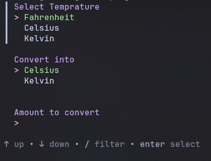

# GO Convert Temprature

A simple CLI application to convert Fahrenheit, Celsius, or Kelvin temprature to other units.

### TUI (Terminal User Interface)

Using [huh](https://github.com/charmbracelet/huh) to make beautiful terminal forms and prompts.

### why i made this project?

I don't understand GO at all, i'm stuck at pointer, so i made this project as a "point" to see how bad my understanding of GO really is.
